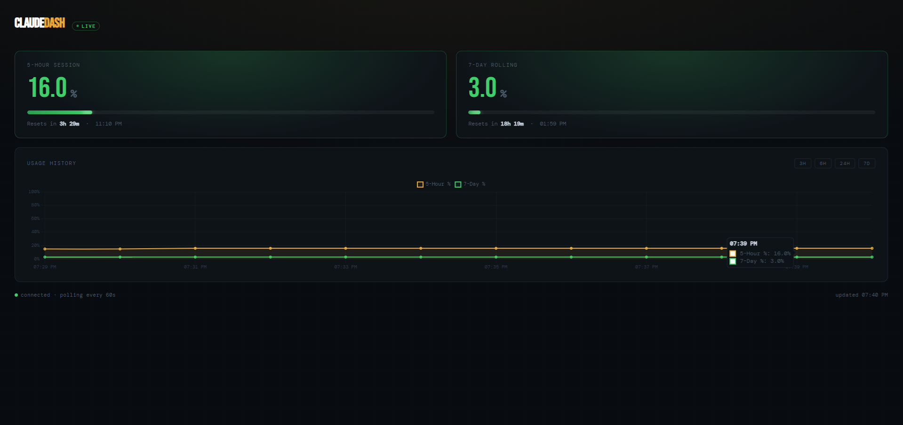

# ClaudeDash

Self-hosted dashboard to monitor your [Claude.ai](https://claude.ai) usage limits in real time.
Polls the claude.ai internal API every 60 seconds and displays your 5-hour session and 7-day rolling utilization with a history graph — accessible from any device on your home network.



---

## Features

- **Live usage bars** — 5-hour session and 7-day rolling utilization
- **Color-coded alerts** — green → yellow → red as you approach limits
- **Reset countdowns** — exact time until each window resets
- **History graph** — view usage over 3h, 6h, 24h, or 7 days
- **SQLite persistence** — history survives container restarts
- **Lightweight** — ~150 MB Docker image, no browser automation needed
- **LAN accessible** — open on any phone, tablet, or laptop on your network

---

## How It Works

Claude.ai is a React app that fetches usage data from an internal API endpoint. ClaudeDash calls that same endpoint using your session cookies, caches the result, and serves it as a clean dashboard.

```
Every 60 seconds:
  POST https://claude.ai/api/organizations/{org_id}/usage
       ↓
  { five_hour: { utilization: 41.0, resets_at: "..." },
    seven_day:  { utilization: 12.0, resets_at: "..." } }
       ↓
  Saved to SQLite → served at http://your-server:3003
```

No Playwright, no headless browser, no Anthropic API key needed.

---

## Requirements

- Docker + Docker Compose
- A Claude.ai account (Pro or Max)
- Google Chrome (to extract session cookies once)

---

## Setup

### 1. Clone the repo

```bash
git clone https://github.com/yourusername/ClaudeDash.git
cd ClaudeDash
```

### 2. Get your session cookies from Chrome

Open [claude.ai](https://claude.ai) in Chrome, then press **F12** → **Application** tab → **Cookies** → click `https://claude.ai`.

Find and copy these values:

| Cookie Name | .env Variable |
|---|---|
| `sessionKey` | `CLAUDE_SESSION_KEY` |
| `lastActiveOrg` | `CLAUDE_ORG_ID` |
| `anthropic-device-id` | `CLAUDE_DEVICE_ID` |
| `ajs_anonymous_id` | `CLAUDE_ANON_ID` |
| `cf_clearance` | `CLAUDE_CF_CLEARANCE` *(optional)* |
| `__cf_bm` | `CLAUDE_CF_BM` *(optional)* |

> **Note:** For `ajs_anonymous_id`, there may be two entries — pick the one with domain `.claude.ai` (value starts with `claudeai.v1.`).

### 3. Create your `.env` file

```bash
cp .env.example .env
```

Edit `.env` and paste your cookie values:

```env
CLAUDE_SESSION_KEY=sk-ant-sid02-...
CLAUDE_ORG_ID=xxxxxxxx-xxxx-xxxx-xxxx-xxxxxxxxxxxx
CLAUDE_DEVICE_ID=xxxxxxxx-xxxx-xxxx-xxxx-xxxxxxxxxxxx
CLAUDE_ANON_ID=claudeai.v1.xxxxxxxx-xxxx-xxxx-xxxx-xxxxxxxxxxxx
CLAUDE_CF_CLEARANCE=optional
CLAUDE_CF_BM=optional
```

### 4. Start the container

```bash
docker compose up --build -d
```

Open **http://localhost:3003** — or `http://your-minipc-ip:3003` from any device on your LAN.

---

## Project Structure

```
ClaudeDash/
├── Dockerfile
├── docker-compose.yml
├── main.py              # FastAPI backend + APScheduler poller
├── requirements.txt
├── public/
│   └── index.html       # Dashboard UI (Chart.js, vanilla JS)
├── data/                # SQLite database (created at runtime, gitignored)
├── .env.example
├── .env                 # Your cookies — never commit this
└── .gitignore
```

---

## Configuration

| Variable | Default | Description |
|---|---|---|
| `POLL_INTERVAL` | `60` | Seconds between API polls |
| `DB_PATH` | `/app/data/usage.db` | SQLite database path |

Change `POLL_INTERVAL` in `docker-compose.yml`:

```yaml
environment:
  - POLL_INTERVAL=60
```

---

## Updating Cookies

Session cookies expire every few weeks. When the dashboard shows an auth error:

1. Re-open Chrome → F12 → Application → Cookies → claude.ai
2. Copy the new `sessionKey` and `cf_clearance` values
3. Update your `.env`
4. Restart: `docker compose restart`

---

## Tech Stack

| Layer | Technology |
|---|---|
| Backend | Python 3.12, FastAPI, APScheduler |
| HTTP client | httpx |
| Database | SQLite |
| Frontend | Vanilla JS, Chart.js |
| Fonts | Bebas Neue (numbers), Syne (headings), DM Mono (UI) |
| Container | Docker, ~150 MB image |

---

## Security Notes

- **Never commit `.env`** — your `sessionKey` is equivalent to your Claude.ai login
- The app runs entirely on your local network — do not expose port 3003 to the internet
- Cookies are read-only; ClaudeDash never writes to your Claude account

---

## Limitations

- Breaks if Anthropic changes the internal API endpoint or response format
- Session cookies expire and need manual renewal every few weeks
- `__cf_bm` (Cloudflare) cookie rotates every ~30 minutes — safe to omit

---

## Inspired By

- [Clawdmeter](https://github.com/HermannBjorgvin/Clawdmeter) by [@HermannBjorgvin](https://github.com/HermannBjorgvin) — ESP32 physical desk dashboard
- [ClaudeMeter](https://github.com/eddmann/ClaudeMeter) by [@eddmann](https://github.com/eddmann)

---

## License

MIT